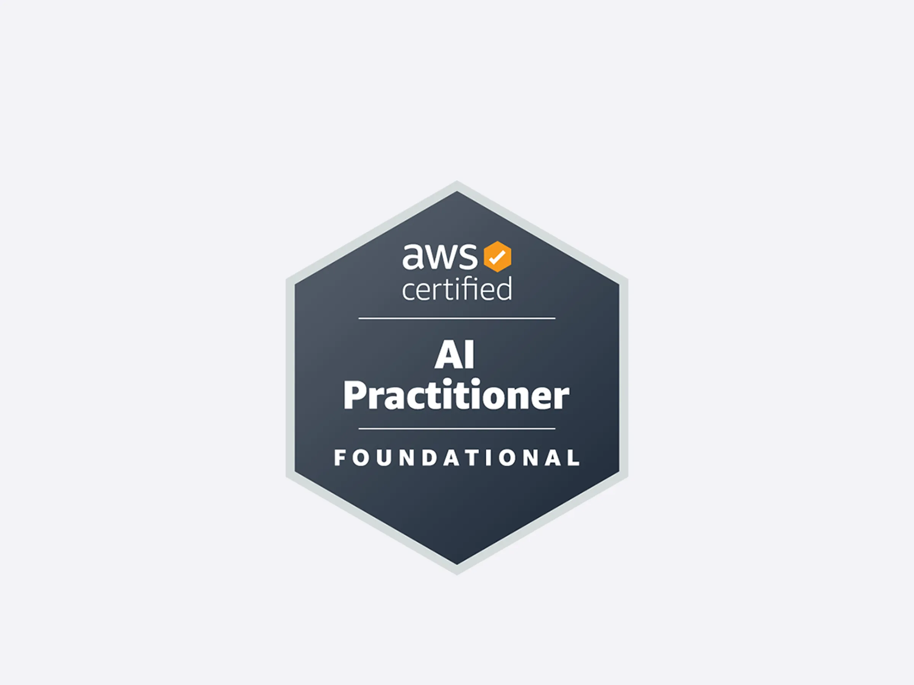

# AWS Certified AI Practitioner (AIF-CO1)

Collection of bullet points summarising various aspects of the AI certificate

# Topics

- [Domain 0 - AWS Fundamentals](topics/0-aws-fundamentals.md)
- [Domain 1 - Fundamentals of AI and ML](topics/1-fundamentals-of-ai-ml.md)
- [Domain 2 -  Fundamentals of GenAI](topics/2-fundamentals-of-genai.md)
- [Domain 3 - Applications of Foundation Models](topics/3-applications-of-foundation-models.md)
- [Domain 4 - Guidelines for Responsible AI](topics/4-guidelines-for-responsible-ai.md)
- [Domain 5 - Security, Compliance and Governance for AI Solutions](topics/5-security-compliance-governance.md)

