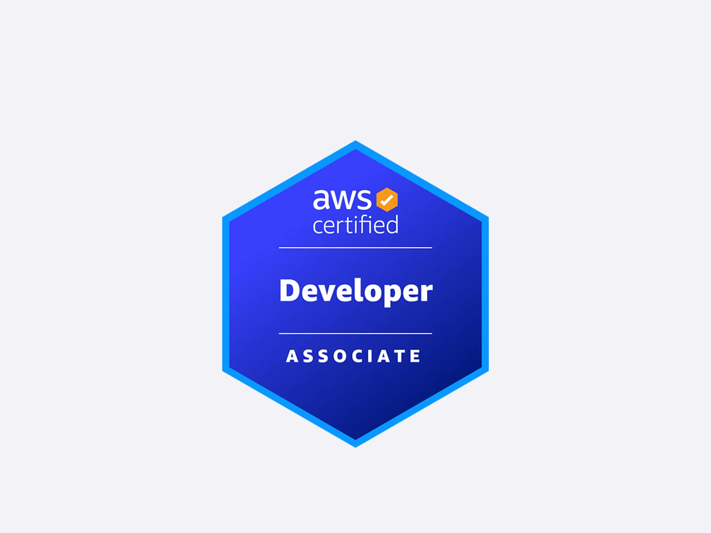

# AWS Certified Developer 

Collection of bullet points summarising various aspects of the Developer certificate

# Topics

- [Domain 1 - Development with AWS Services](domains/1-development-with-aws-services.md)
- [Domain 2 - Security](domains/2-security.md)
- [Domain 3 - Deployment](domains/3-deployment.md)
- [Domain 4 - Troubleshooting and Optimization](domains/4-troubleshooting-optimization.md)

